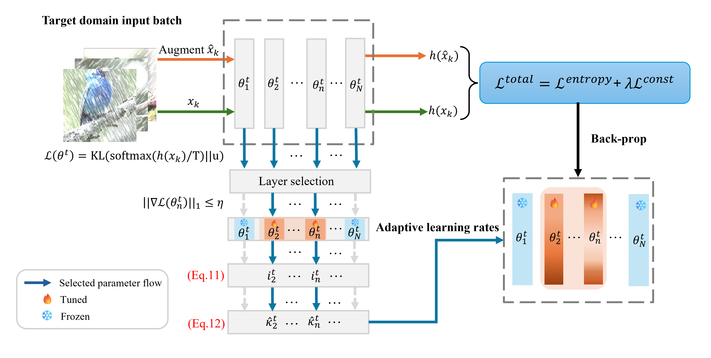

<div align="center">

## PALM: Pushing Adaptive Learning Rate Mechanisms for Continual Test-Time Adaptation

PyTorch code for the AAAI 2025 paper. 

<em> Sarthak Kumar Maharana, Baoming Zhang, and Yunhui Guo </em>
<br>
<em> AAAI 2025 </em>

[arXiv](https://arxiv.org/abs/2403.10650)

### Abstract 
Real-world vision models in dynamic environments face rapid shifts in domain distributions, leading to decreased recognition performance. Using unlabeled test data, continuous test-time adaptation (CTTA) directly adjusts a pre-trained source discriminative model to these changing domains. A highly effective CTTA method involves applying layer-wise adaptive learning rates for selectively adapting pre-trained layers. However, it suffers from the poor estimation of domain shift and the inaccuracies arising from the pseudo-labels. This work aims to overcome these limitations by identifying layers for adaptation via quantifying model prediction uncertainty without relying on pseudo-labels. We utilize the magnitude of gradients as a metric, calculated by backpropagating the KL divergence between the softmax output and a uniform distribution, to select layers for further adaptation. Subsequently, for the parameters exclusively belonging to these selected layers, with the remaining ones frozen, we evaluate their sensitivity to approximate the domain shift and adjust their learning rates accordingly. We conduct extensive image classification experiments on CIFAR-10C, CIFAR-100C, and ImageNet-C, demonstrating the superior efficacy of our method compared to prior approaches.



</div>

### Catalog
- [x] Environment setup
- [x] Datasets
- [x] Source models
- [x] Experiments

We build our code based upon the codebase provided by [TTA baselines](https://github.com/mariodoebler/test-time-adaptation) and [LAW](https://github.com/junia3/LayerwiseTTA/tree/main).

#### Environment Setup
Please create and activate the following conda environment to reproduce our results. 

```bash
conda update conda
conda env create -f env_palm.yml
conda activate palm
```
If PyTorch does not work, you might have to install it manually. We use PyTorch 1.13.1 and torchvision 0.14.1+cu117 for our experiments.

#### Datasets 
In our work, we perform classification experiments on CIFAR-10C, CIFAR-100C, and ImageNet-C. The CIFAR datasets will be automatically downloaded by [RobustBench](https://github.com/RobustBench/robustbench). However, for ImageNet-C, please download from this [link](https://zenodo.org/records/2235448#.Yj2RO_co_mF) and save it at data/.

Finally, the dataset directory should look as follows, 

```bash
PALM
├── data
│   ├── CIFAR-10C
│   ├── CIFAR-100C
│   ├── ImageNet-C
...
```
Please head to classification/conf.py to specify your data directory i.e, change ```_C.DATA_DIR``` to point to your dataset directory. 


#### Source models
All the pre-trained weights of the source models used in our work are available and provided by [RobustBench](https://github.com/RobustBench/robustbench), ```torchvision``` or ```timm```. For the additional source models, as used in the supplementary material, we use the pre-trained ResNet-50 from [TTT++](https://github.com/vita-epfl/ttt-plus-plus/tree/main/cifar). All thanks to [LAW](https://github.com/junia3/LayerwiseTTA/tree/main) for making this a seemless experience. 

##### CIFAR10 (WRN) pre-trained weights [IMPORTANT]
Download from here - [Link](https://drive.google.com/u/0/uc?id=1t98aEuzeTL8P7Kpd5DIrCoCL21BNZUhC&export=download) and save it at ckpt/cifar10/corruptions.
Then, go to the load_model function at classification/robustbench/utils.py and change the path of the pre-trained weights (line 126). The original robustbench is broken so you'll have to manually download. 


#### Experiments
In our paper, including the supplementary, we perform experiments in three TTA settings - 
- ```Continual TTA (CTTA)```
- ```Gradual TTA (GTTA)```
- ```Mixed-Domain TTA (MDTTA)``` 
The user is also free to explore other TTA settings that are supported by our code. Please check ```classification/test_time.py``` for more. 

To begin, 
```bash
cd classification
```

To reproduce our CTTA results on CIFAR-10C, CIFAR-100C, and ImageNet-C,
```bash
python3 test_time.py  --cfg cfgs/cifar10_c/ours.yaml SETTING continual
```
```bash
python3 test_time.py  --cfg cfgs/cifar100_c/ours.yaml SETTING continual
```
```bash
python3 test_time.py  --cfg cfgs/imagenet_c/ours.yaml SETTING continual
```

Similarly, for GTTA and MDTTA, please change ```SETTING``` to gradual or mixed-domains. It is worth mentioning that the configuration of our work and the baselines, for each dataset, are provided in ```classification/cfgs/```. Specifically, the config file of our method is ours.yaml. All the logs will be saved in ```output/```

In addition, we provide the TTA method for surgical fine-tuning. It can be found in ```classification/methods/surgical.py```. The corresponding config file can be found in ```classification/cfgs/``` as surgical.yaml for each of the datasets. 

We encourage the user to try out other parameters and methods.

#### Citation
If you found our work useful for your research, please cite our work. Feel free to contact ```SKM200005@utdallas.edu```
